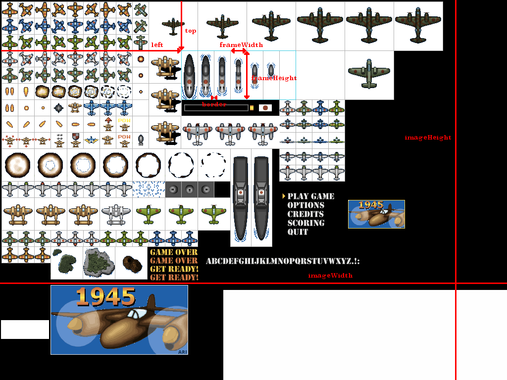

# anima

A 2D animation library for Odin

Inspired by the LÖVE library [anim8](https://github.com/kikito/anim8)

## Compatibility

This library is implemented to be renderer agnostic, however there is a raylib implementation available in ``anima/anima_raylib``.

## Installation

Copy the ``anima`` directory somewhere into your project as this is the package, feel free to delete the sub directories inside that you do not need like ``anima/anima_raylib`` if you for instance do not use raylib.

(You might also want to use git submodules)

## Usage

Check out one of the examples:

- [anim8 1945 example](./examples/anim8_1945/main.odin) (port of the anim8 demo)
- [cat fighter fsm](./examples/cat_fighter_fsm) - Animations with a finite state machine

### Simple Example

```odin
package main

// assuming you have the package located in a directory adjacent to the current package
import "anima"
import "anima/anima_raylib"
import rl "vendor:raylib"

main :: proc() {
  rl.InitWindow(800, 600, "Simple Example")
  defer rl.WindowClose()

  rl.SetTargetFPS(60)


  image := rl.LoadImage("path/to/image.png")
  texture := rl.LoadTextureFromImage(image)
  defer rl.UnloadTexture(texture)
  rl.UnloadImage(image)

  // first we need to define our grid
  grid := anima.new_grid(32, 32, texture.width, texture.height)

  animation := anima.new_animation(
    // here we specify we want column: 0-7 in row: 0
    anima.grid_frames(&grid, "0-7", 0),
    // and the animation speed is 0.1s
    0.1,
  )
  // don't forget to clean up after yourself
  defer anima.destroy_animation(animation)

  for !rl.WhileWindowShouldclose() {
    dt := rl.GetFrameTime()

    // update the animation before drawing
    anima.update(animation, dt)

    rl.BeginDrawing()
    rl.ClearBackground(rl.RAYWHITE)

    // and finally draw the animation
    anima_raylib.draw(animation, texture, 100, 100)

    rl.EndDrawing()
  }
}
```

## Documentation

### Grids

Grids exist to make it as easy as possible to quickly define animations using rectangles of the same size.

You can define a grid like this:

```odin
anima.new_grid(
  frame_width,  // the width of the frame
  frame_height, // the height of the frame
  image_width,  // the width of the image (or part of said image) from which we get the frame
  image_height, // the height of the image (or part of said image) from which we get the frame
  left,         // (optional) starting x positon of our grid, this is used to define multiple grids within a single file
  top,          // (optional) starting y position of our grid, this is used to define multiple grids within a single file,
  border,       // (optional) this allows you to define gaps between images
) -> Grid {
```


(Took this explanation from the anim8 repo)

To get frames from a grid you need to call the ``anima.grid_frames`` procedure

```odin
anima.grid_frames(
  grid_ptr,                // a pointer to our grid
  column_interval_range_0, // the defined column range of our animation
  row_interval_range_0,    // the defined row range of our animation
  column_interval_range_1, // the defined column range of our animation
  row_interval_range_1,    // the defined row range of our animation
  column_interval_range_2, // the defined column range of our animation
  row_interval_range_2,    // the defined row range of our animation
  // .... this is a variadic function so this can take as many arguments as you want
)

### Animations 

Animations are a group of frames that change after a set duration

```odin
animation := anima.new_animation(
  frames,      // the frames to play, this should be supplied using grids
  duration,    // the duration each frame will take until the next one will play
  playing,     // (optional) is the animation playing? Default is true
  oneshot,     // (optional) should the animation only play once? Default is false
  on_finished, // (optional) a callback that will be called every time the current animation has finished
)
```

new_animation returns a pointer to an animation so you also have to call 

```odin
anima.destroy_animation(animation)
```

after you are done with it.

The animation structs also has a flip\_h and flip\_v property in case you want to flip the sprite.

## Assets

- examples/anim8_1945/assets/1945.png - [Widgetworx Spritelib](http://www.widgetworx.com/widgetworx/portfolio/spritelib.html)
- examples/cat_fighter_fsm/assets/cat_fighter.pn - [dogchicken from opengameart.org](https://opengameart.org/content/cat-fighter-sprite-sheet)

## License

MIT
